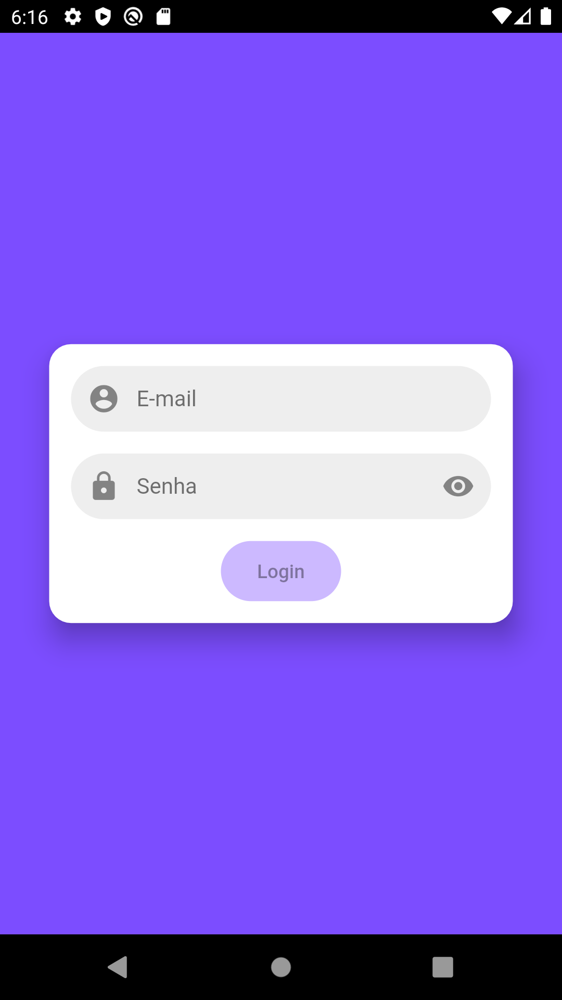
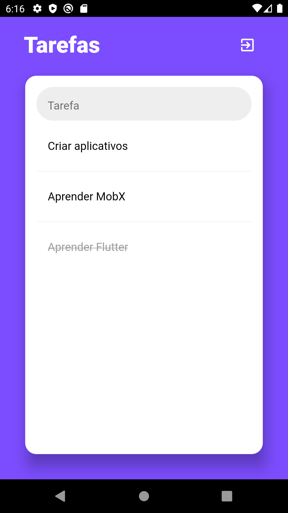

# todo-flutter-mobx
To-do list feito com flutter, utilizando o gerenciador de estados Mobx e banco de dados com o SQLFLITE.

<h4 align="center">

</h4>

O App foi desenvolvido para estudos do Mobx junto com o uso de banco de dados. Melhorias são aceitas.

## Ferramentas
* [Mobx](https://pub.dev/packages/mobx)
* [Flutter Mobx](https://pub.dev/packages/flutter_mobx)
* [Codegen](https://pub.dev/packages/mobx_codegen)
* [Build Runner](https://pub.dev/packages/build_runner)
* [SQLFLITE](https://pub.dev/packages/sqflite)

## Funcionalidades
* Tela de login
* Validadores no Login
* Adicionar tarefas
* Atualizar o status da taref

